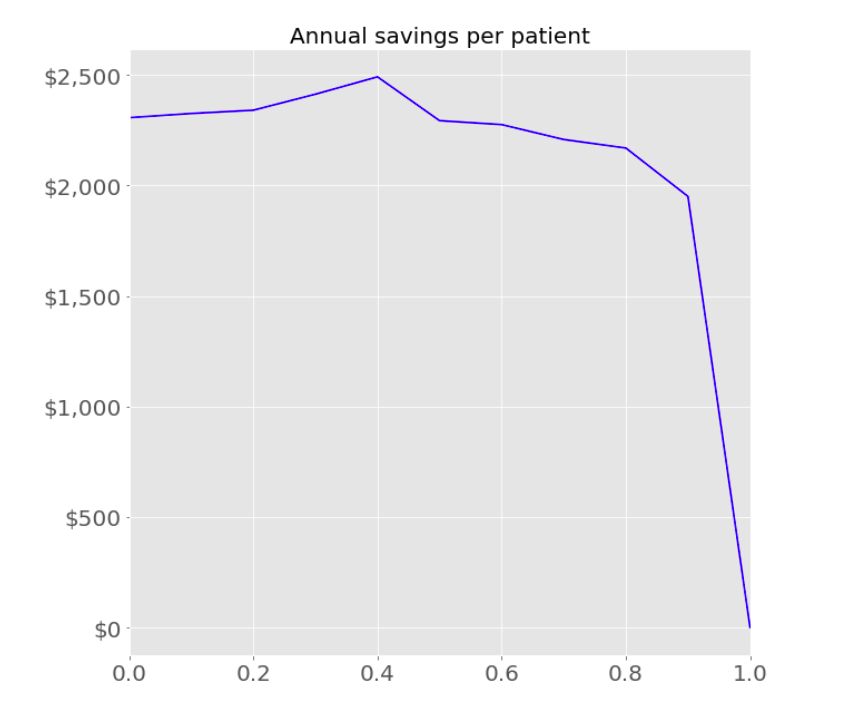

# Medical Records Optimization & Data Driven Interventions

 As a contract Data Scientist for a medical-records company I built a data-optimization pipeline that extracts structured information from clinical notes using NLP and latent dirichlet allocation topic modeling. Additionally, I built a tool for our users that utilizes supervised machine learning to predict the probability of annual hospitalization given the contents of a specified medical note. This tool is estimated to save up $2,500 per patient annually by targeting preventative interventions for patients most at risk for hospitalization.

## Background
This project was built for the purpose of optimizing information exchange in health care.

Capstone project for Data Science Immersive at [Galvanize](https://www.galvanize.com/seattle/data-science|Galvanize) in Seattle.

### Objectives
>Extract structured data from unstructured medical texts through a secure AWS python integrated class

>Deploy NLP and topic modeling to label medical encounters

>Model the probability of a specified encounter resulting in hospitalization.

>Deploy structured database with models as sustainable secure software on cloud

###  The Data
DISCLAIMER: The data used for this is highly sensitive private health care information and therefore cannot be shared outside of BloomAPI  Copyright (c) 2017 Copyright Holder All Rights Reserved.  

## Files

Place images here

## Built With

* [Python](https://www.python.org/)
* [Amazon Web Services](https://aws.amazon.com/)
* [Postgres](https://www.postgresql.org/)
* [scikit-learn](http://scikit-learn.org/stable/)
* [genism](https://radimrehurek.com/gensim/)

## Partner Company

* **BloomAPI** - (https://www.bloomapi.com/)

## Acknowledgments

* The instructors at Galvanize: Matt Drury, Miles Erickson, and Jack Bennetto
